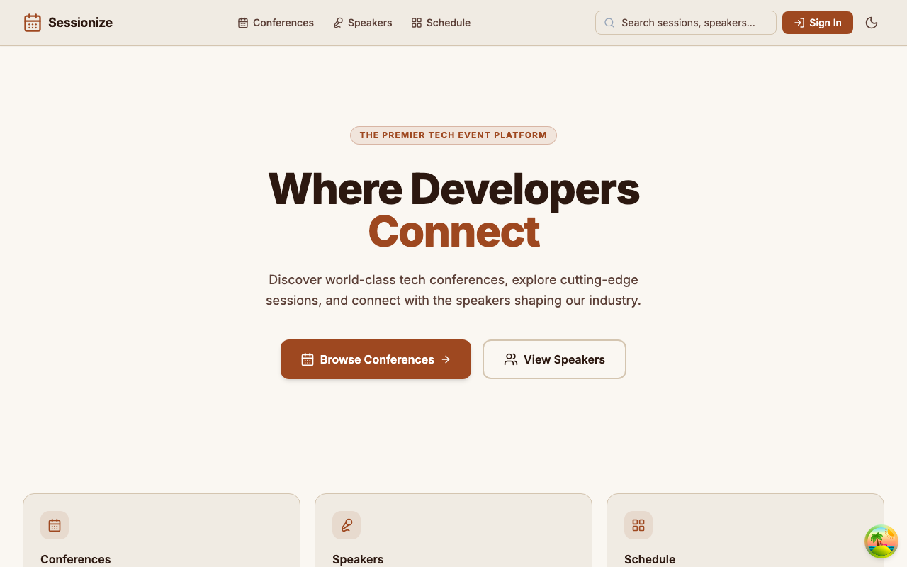
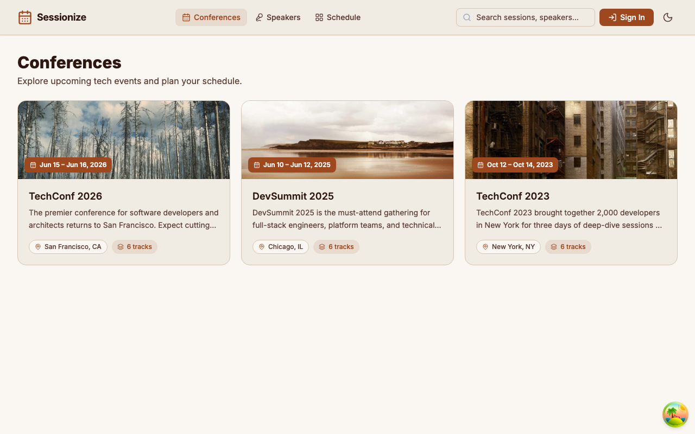
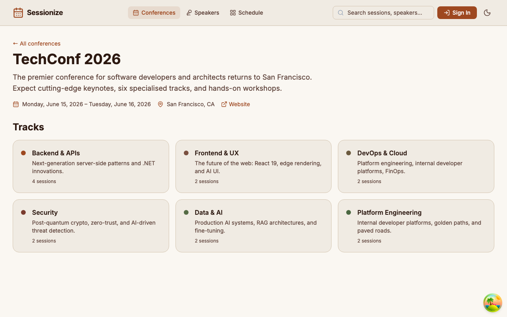
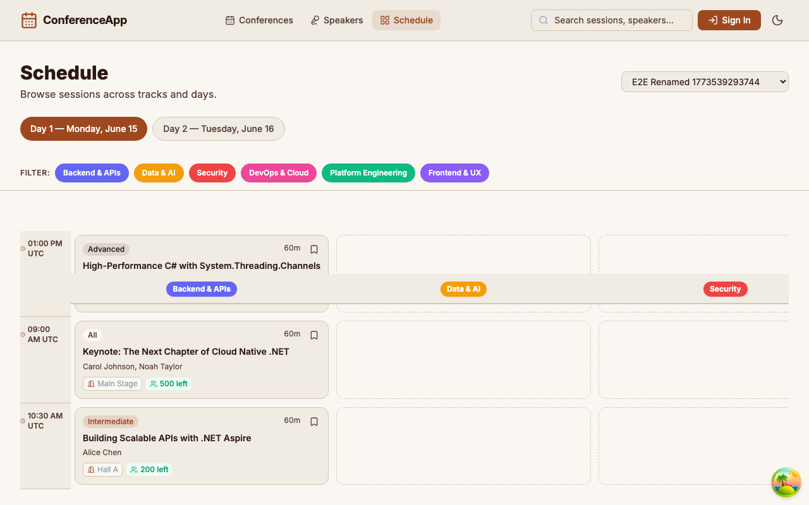
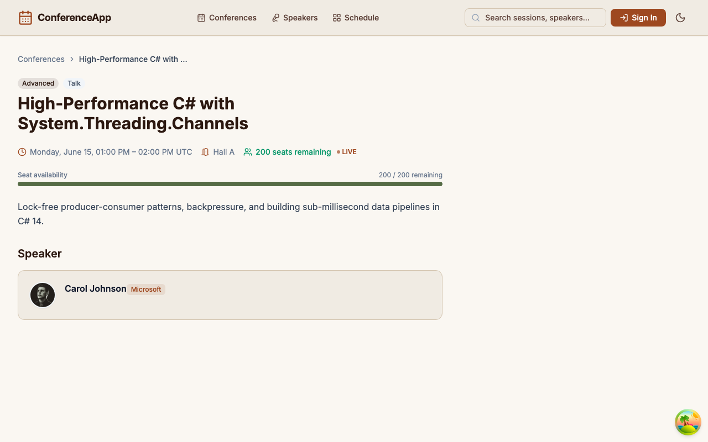
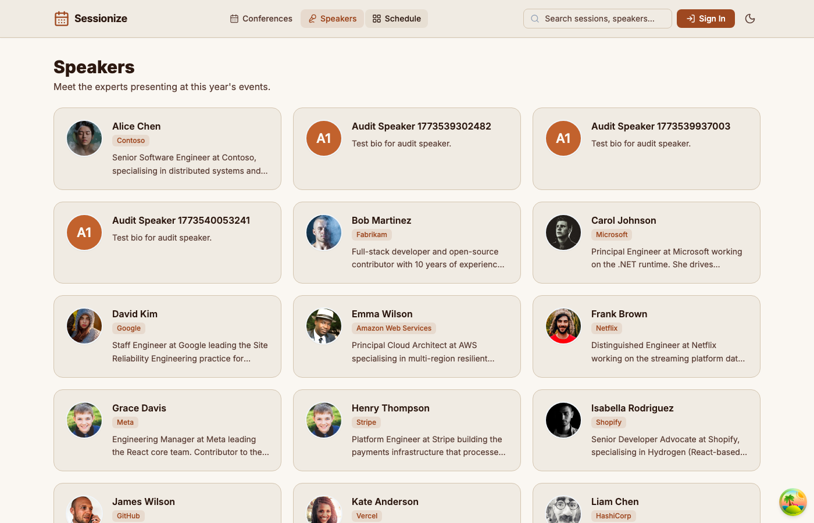

# Sessionize

A full-stack conference management web app built with **React + .NET Aspire + PostgreSQL**, managed by an AI orchestrator that assigns tasks to specialised agents and keeps work moving automatically.

## The App

Browse conferences, explore tracks and sessions, view speaker profiles, and register for sessions — all in a responsive React UI backed by a .NET API orchestrated with Aspire.

| Layer | Technology |
|-------|-----------|
| Frontend | React 19 · TypeScript · Vite · Tailwind CSS · React Query · React Router v7 |
| Backend | ASP.NET Core (.NET 10) · Entity Framework Core · JWT auth |
| Database | PostgreSQL (via Aspire container) |
| Orchestration | .NET Aspire 13 (AppHost) |

## Architecture

```
Sessionize.AppHost   ← .NET Aspire orchestrator (starts everything)
Sessionize.Api       ← ASP.NET Core 10 REST API + EF Core + JWT auth
Sessionize.Models    ← Shared domain models
frontend/               ← React 19 + Vite + TypeScript + Tailwind CSS
PostgreSQL              ← Managed as an Aspire container resource
```

Aspire wires up the API, database, and frontend in a single process and exposes a dashboard for logs, traces, and health.

## Screenshots

### Home — Conference Listing


### Browse Conferences


### Conference Detail


### Schedule


### Session Detail


### Speakers


### Admin Dashboard


## Getting Started

### Prerequisites

| Tool | Version |
|------|---------|
| [.NET 10 SDK](https://dotnet.microsoft.com/download) | 10.x |
| [Node.js](https://nodejs.org) | 20+ |
| [Docker Desktop](https://www.docker.com/products/docker-desktop/) | latest (for the PostgreSQL container) |

### Run with Aspire

```bash
# Install frontend dependencies (first time only)
cd frontend && npm install && cd ..

# Start the full stack — API, PostgreSQL, and frontend together
cd Sessionize.AppHost && dotnet run
```

The API automatically runs EF migrations and seeds demo data (TechConf 2026) on first start.

### Aspire Dashboard

Look for a line like this in the terminal output:

```
Login to the dashboard at https://localhost:17187/login?t=<token>
```

Open that URL — the token is required on first load. The dashboard shows resource health, logs, and distributed traces.

### Finding the frontend URL

Aspire assigns the Vite dev server a **dynamic port** on each run. Discover it two ways:

```bash
# Option 1 — check running node processes
lsof -i TCP -P -n | grep LISTEN | grep node

# Option 2 — Aspire dashboard → Resources tab → frontend → Endpoints column
```

### Fixed URLs

| Service | URL |
|---------|-----|
| API | https://localhost:7133 |
| Aspire dashboard | https://localhost:17187 (token in terminal) |
| Swagger UI | https://localhost:7133/swagger (dev only) |

### Seeded credentials

| Role | Email | Password |
|------|-------|----------|
| Admin | `admin@conference.dev` | `Admin123!` |
| Test user | `user1@test.dev` | `Test123!` |
| Test user | `user2@test.dev` | `Test123!` |
| Test user | `user3@test.dev` | `Test123!` |

### Running E2E tests

E2E tests use Playwright against the live Aspire stack. Find the frontend port first (see above), then:

```bash
cd frontend
APP_URL=http://localhost:<frontend-port> npx playwright test --config playwright.local.config.ts
```

> See [QUICK_START.md](./QUICK_START.md) for more detail.

## Production Deployment

> **Note:** Production deployment uses Docker Compose. This is separate from the local Aspire dev workflow above.

```bash
# 1. Copy the example env file and fill in your secrets
cp .env.example .env
# Edit .env — change POSTGRES_PASSWORD and Jwt__Key (must be ≥ 32 chars)

# 2. Start all services
docker compose up -d

# 3. Follow logs (optional)
docker compose logs -f
```

| Service | URL |
|---------|-----|
| Frontend | http://localhost:3000 |
| API | http://localhost:8080 |
| API health | http://localhost:8080/health |

```bash
docker compose down      # stop
docker compose down -v   # stop and delete postgres volume
```

## API Endpoints

| Method | Route | Description |
|--------|-------|-------------|
| `GET` | `/api/conferences` | Paginated conference list |
| `GET` | `/api/conferences/{id}` | Conference detail with tracks |
| `POST` | `/api/conferences` | Create conference |
| `GET` | `/api/conferences/{id}/tracks` | Tracks for a conference |
| `GET` | `/api/conferences/{id}/tracks/{trackId}` | Track detail with sessions |
| `GET` | `/api/sessions` | Sessions (filter: `trackId`, `conferenceId`) |
| `GET` | `/api/sessions/{id}` | Session detail with speakers |
| `GET` | `/api/speakers` | All speakers |
| `GET` | `/api/speakers/{id}` | Speaker detail with sessions |
| `POST` | `/api/auth/register` | Create account → JWT |
| `POST` | `/api/auth/login` | Login → JWT |
| `GET` | `/api/auth/me` | Current user profile (🔒) |

Swagger UI: `https://localhost:7133/swagger` (development only)

## Project Structure

```
Sessionize.sln
├── Sessionize.AppHost/          # .NET Aspire orchestrator
├── Sessionize.Api/              # ASP.NET Core Web API
│   ├── Controllers/                # Conferences, Tracks, Sessions, Speakers, Auth
│   ├── Data/                       # DbContext, migrations, seeder
│   ├── DTOs/                       # Request/response records
│   └── Services/                   # TokenService (JWT)
├── Sessionize.Models/           # Domain models (shared library)
│   └── Conference, Track, Session, Speaker, User, Registration
frontend/                           # React app
│   └── src/
│       ├── pages/                  # ConferencesPage, ConferenceDetailPage, TrackDetailPage, ...
│       ├── components/             # Layout, LoadingSpinner, ErrorMessage, LevelBadge
│       ├── services/api.ts         # axios client with JWT interceptor
│       └── types/index.ts          # TypeScript interfaces
src/                                # Orchestrator CLI
backlog/                            # Task tracking (Backlog.md)
.github/agents/                     # Agent instruction files
```

## AI Orchestrator

This repo uses an **orchestrator + specialised agents** system to build the app automatically.

### Skill-based agents

| Agent | Handles |
|-------|---------|
| `aspire-expert` | AppHost, infrastructure, containers, OTel |
| `dotnet-developer` | API controllers, services, middleware |
| `database-developer` | EF Core models, migrations, schema |
| `react-developer` | React pages, components, hooks |
| `designer` | UI/UX, Tailwind components, accessibility |
| `tester` | Playwright e2e tests, bug filing |

### Orchestrator commands

```bash
# Continuous loop — assigns To Do tasks, detects stuck work, files bugs
orchestrator ralph

# One-shot tag & assign all tasks by label
orchestrator tag

# Assign a specific task
orchestrator assign 3.1 --agent dotnet-developer

# File a bug
orchestrator bug "Login fails on Safari" --task 4.2 --priority high

# See all tasks and assignments
orchestrator status
backlog task list --plain
```

### Ralph loop

The `ralph` loop runs continuously, scanning the backlog every 30 seconds:
- Assigns new **To Do** tasks to the right skill agent based on labels
- Detects tasks stuck **In Progress** and auto-files bug reports
- Persists state in `backlog/.ralph-state.json`

```bash
orchestrator ralph --interval 30   # run forever
orchestrator ralph --dry-run       # preview without changes
```

## Task Board

```bash
backlog board          # terminal Kanban board
backlog browser        # web UI
backlog task list --plain
```

## Learn More

- [Orchestrator Documentation](./ORCHESTRATOR.md)
- [Quick Start Guide](./QUICK_START.md)
- [Agent Instructions](./.github/agents/)
- [Aspire Documentation](https://aspire.dev)

